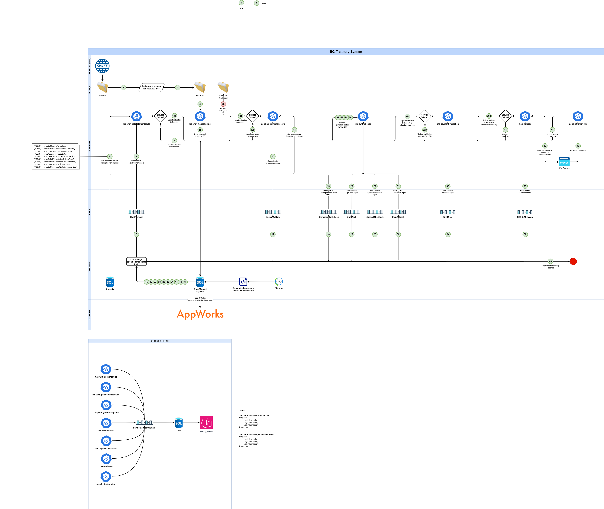

# 🧪 Test Automation for BG Treasury System

This repository contains the **UI Test Automation Framework** for the BG Treasury System. It enables automated validation of mission-critical workflows using **Selenium** and **NUnit**, ensuring stability, compliance, and quality across application deployments.

---

## 📌 Project Overview

The **BG Treasury System** automates the ingestion, validation, enrichment, and tracking of **SWIFT payment messages** (e.g., `pacs.008`). Designed using **microservices**, **Kafka topics**, and **SQL-based orchestration**, the system ensures efficient and accurate financial transaction processing.

This automation framework targets the **UI layer**, simulating real user interactions to validate business rules, workflow logic, and system behavior.

---

## 🔭 Test Objectives

- Automate essential test scenarios to speed up releases
- Validate core UI workflows and business rules
- Ensure regression stability through repeatable automated tests
- Generate structured reports and logs for transparency and debugging

---

## ✅ Framework Features

- 🚀 **Selenium WebDriver** for reliable browser automation
- 🧪 **NUnit** for test lifecycle management and assertions
- 📊 **ExtentReports** for interactive HTML reports with screenshots
- 📝 **log4net** for configurable logging across tests
- 🔧 Config-driven setup: environment URLs, browser drivers, timeouts
- 🔁 Safe-click utilities and retry logic to handle UI flakiness
- 📸 Auto-capture screenshots on test pass/failure

---

## 🚀 Project Setup

> ⚠️ Prerequisites:

- .NET 8.0 SDK or higher
- Google Chrome browser installed
- ChromeDriver path configured
---
## :gear: Config file contain 
- Basis for all Test Environments Setup 
- User Authentication 
- path to browser including base URI
- Link to web browser
- `dotnet test --logger:console;verbosity=detailed` run tests fom cli

---

# 💼 BG Treasury System - SUT

The BG Treasury System automates the processing, validation, enrichment, and tracking of **SWIFT payments and transactions**. It is built using **microservices**, **Kafka topics**, and **SQL-backed orchestration**, providing robust, scalable, and traceable financial transaction processing.

---

### 📊 System Overview

The system ingests **ISO 20022 pacs.008** messages and performs the following high-level tasks:

- 📥 Message ingestion from SWIFT via XML
- 🛡 File detection and screening via Embargo server
- 🔄 Kafka-based event processing pipeline
- 🧠 Microservices for validation, enrichment, and business logic
- 💾 Data persistence in Phoenix SQL DB
- 👤 User interaction and auditing via AppWorks portal

---

### 🧩 Architecture

### 🔑 Key Components

| Component       | Description                                             |
| --------------- | ------------------------------------------------------- |
| Trustlink SWIFT | Source of incoming `.xml` payment messages            |
| Embargo Server  | Monitors folders, archives files, triggers Kafka events |
| Kafka Topics    | Event-driven transitions between processing stages      |
| Microservices   | Handle parsing, validation, enrichment, routing         |
| Kubernetes      | Orchestration of microservices                          |
| Phoenix DB      | SQL database for persistence and lookups                |
| AppWorks        | Portal for user actions, reprocessing, audit trails     |

---

## 🛰 Kafka Topics Flow

Each Kafka topic represents a **checkpoint** in the end-to-end processing lifecycle:

| Topic Name             | Description                                               |
| ---------------------- | --------------------------------------------------------- |
| `NewPayment`         | Initial parsed payments from SWIFT files                  |
| `ExchangeRate`       | Messages enriched with FX rate data from DB or APIs       |
| `CorrespondentCheck` | Payments passing correspondent bank validation            |
| `StpCheck`           | Validated against stop-list rules (e.g., sanctions/fraud) |
| `SpecialRateCheck`   | Checked for special/bulk transaction rates                |
| `DealCheck`          | Ensures FX deals and rules compliance                     |
| `Validation`         | Final business rule validations                           |
| `FMC Submission`     | Specialized Deal ID/FMC submission stage                  |

> ⚠️ Each topic is consumed/produced by dedicated microservices, ensuring asynchronous, decoupled processing.

---

## 🔁 Process Flow

1. **File Pickup**

   - SWIFT files arrive in monitored folders
2. **Embargo Server**

   - Archives the file and triggers Kafka processing
3. **Kafka-Driven Microservices**

   - Parsing → Enrichment → Rule Checks → Routing
4. **Database Operations**

   - Phoenix DB stores data and supports enrichment via lookups
5. **Downstream Systems**

   - Data flows to Mainframe, validation layers, reconciliation
6. **User Interaction**

   - AppWorks provides audit logs, retry features, and manual overrides

---
